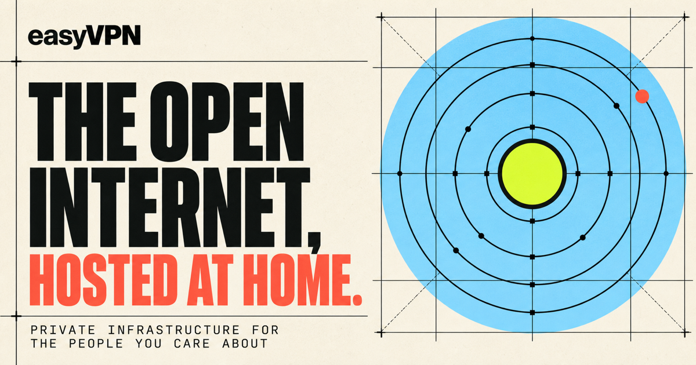

<p align="center">
  
</p>

<h1 align="center">easyVPN</h1>

<p align="center">
  Turn a home Mac into a private, censorship-resistant internet gateway<br>
  for the people you care about.
</p>

<p align="center">
  <a href="https://bryanhu.com/easyVPN/"><strong>Website</strong></a> ·
  <a href="#quick-start"><strong>Quick start</strong></a> ·
  <a href="docs/DEVELOPMENT.md"><strong>Architecture</strong></a>
</p>

<p align="center">
  <a href="https://github.com/ThatXliner/easyVPN/actions/workflows/pages.yml"></a>
  
  
</p>

---

easyVPN is a small control plane for running your own VPN from a Mac that stays
at home. It packages [Reality](https://sing-box.sagernet.org/configuration/inbound/vless/)
and [Hysteria2](https://sing-box.sagernet.org/configuration/inbound/hysteria2/)
behind a four-step desktop app and a scriptable CLI.

You set up the server once, add a guest, and send them a private link or QR
code. Every guest gets separate credentials, so you can revoke one person
without disrupting everyone else.

## Why easyVPN?

- **No VPN subscription.** The gateway runs on hardware and an internet
  connection you already control.
- **Built for difficult networks.** Guests can choose a fast Hysteria2 route or
  a stealthier Reality fallback.
- **No configuration maze.** The app walks through system setup, server
  identity, router rules, and guest access.
- **Local by default.** Server state and credentials remain on the host Mac.
- **Two interfaces, one engine.** The desktop app and CLI operate on the same
  state, so they can be used interchangeably.

## How it works


The setup flow is intentionally short:

1. **Check** the Mac, local network, Homebrew, and `sing-box`.
2. **Create** a server identity and keep its secrets locally.
3. **Route** TCP 443 and UDP 443 from the home router to the Mac.
4. **Share** a unique link or QR code with each guest.

## Quick start

You need:

- a Mac that can stay online while guests are connected;
- [Homebrew](https://brew.sh); and
- access to the home router's port-forwarding settings.

Then clone the project and run the setup assistant:

```bash
git clone https://github.com/ThatXliner/easyVPN.git
cd easyVPN
./setup.sh
```

The script checks the prerequisites, optionally installs Rust, installs
`sing-box`, builds the CLI, creates the server identity, adds the first guest,
and prints the two router rules. It is idempotent, so it is safe to run again.

The router step is currently manual. Forward both rules to the Mac:

| Protocol | External port | Internal port |
| --- | ---: | ---: |
| TCP | 443 | 443 |
| UDP | 443 | 443 |

When the rules are in place, start the gateway:

```bash
sudo easyvpn start
```

## Desktop app

There is not a signed binary release yet, so the graphical app is built from
source:

```bash
npm install
npm run tauri dev
```

To produce a double-clickable macOS app and DMG:

```bash
npm run tauri build
```

The desktop app and CLI read the same server state from
`~/Library/Application Support/com.me.easyvpn/`.

## Give someone access

Add a separate guest for every person or device:

```bash
easyvpn guest add phone
```

easyVPN prints two private links. Have the guest install a compatible client,
paste one link, and connect.

| Device | Compatible clients |
| --- | --- |
| iPhone / iPad | Hiddify, Streisand |
| Android | Hiddify, v2rayNG |
| Windows | Hiddify, v2rayN |
| macOS | Hiddify |

Try the **Hysteria2** link first for throughput on unreliable networks. Use the
**Reality** link if the first route is blocked or unstable.

> [!IMPORTANT]
> A guest link is a password. Send it through a private channel, never post it
> publicly, and create separate credentials for each person.

Revoke a guest and apply the change:

```bash
easyvpn guest rm phone
sudo easyvpn start
```

## CLI reference

```text
easyvpn status                 Check dependencies, addresses, and server state
easyvpn install                Install sing-box with Homebrew
easyvpn init                   Create the server identity
easyvpn ports                  Print the required router rules
easyvpn guest add <name>       Create credentials and print share links
easyvpn guest list             List guests and links (--json is available)
easyvpn guest rm <name>        Revoke one guest
sudo easyvpn start             Apply config, start now, and enable at boot
sudo easyvpn stop              Stop the server and remove the boot service
```

## Before you rely on it

easyVPN is an early-stage, macOS-only project. A few practical constraints are
worth understanding:

- The host Mac must stay awake and connected.
- The router must support inbound port forwarding. Connections behind CGNAT
  may require additional ISP or network setup.
- Some ISPs block inbound port 443.
- Share links use the current public IP. If it changes, generate and resend the
  links.
- There is no automatic updater or signed release channel yet.
- Laws and network policies vary. Understand the rules that apply to you and
  use the project responsibly.

## Development

The tested Rust engine is shared by the CLI and the Tauri app. The React
frontend is also the source for the project website: browsers render the public
landing page, while Tauri renders the setup interface.

```bash
cargo test --workspace          # Rust unit tests
npm run build                   # TypeScript + production web build
npm run tauri build -- --debug  # Native app and DMG
./scripts/e2e.sh                # Real local tunnels through both protocols
```

See [docs/DEVELOPMENT.md](docs/DEVELOPMENT.md) for the architecture, service
model, test strategy, and security notes.

## Contributing

Issues and focused pull requests are welcome. The most useful areas right now
are configurable ports, clearer network diagnostics, signed releases, and
additional platform support.

Built on [sing-box](https://github.com/SagerNet/sing-box).
